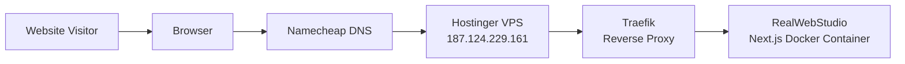
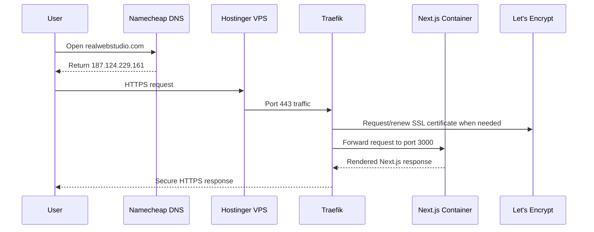
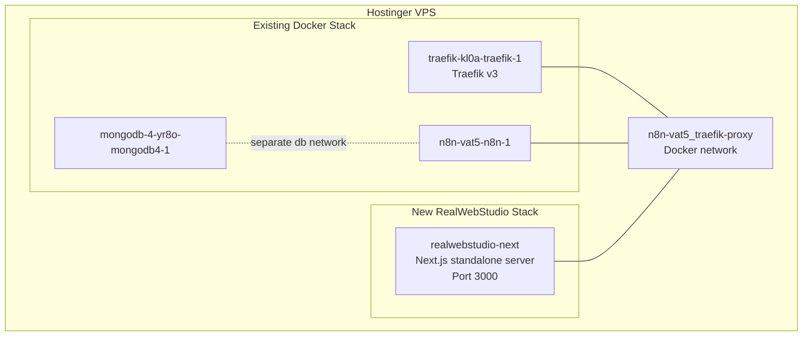
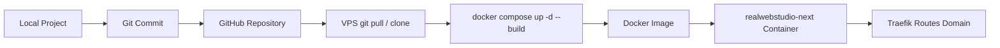
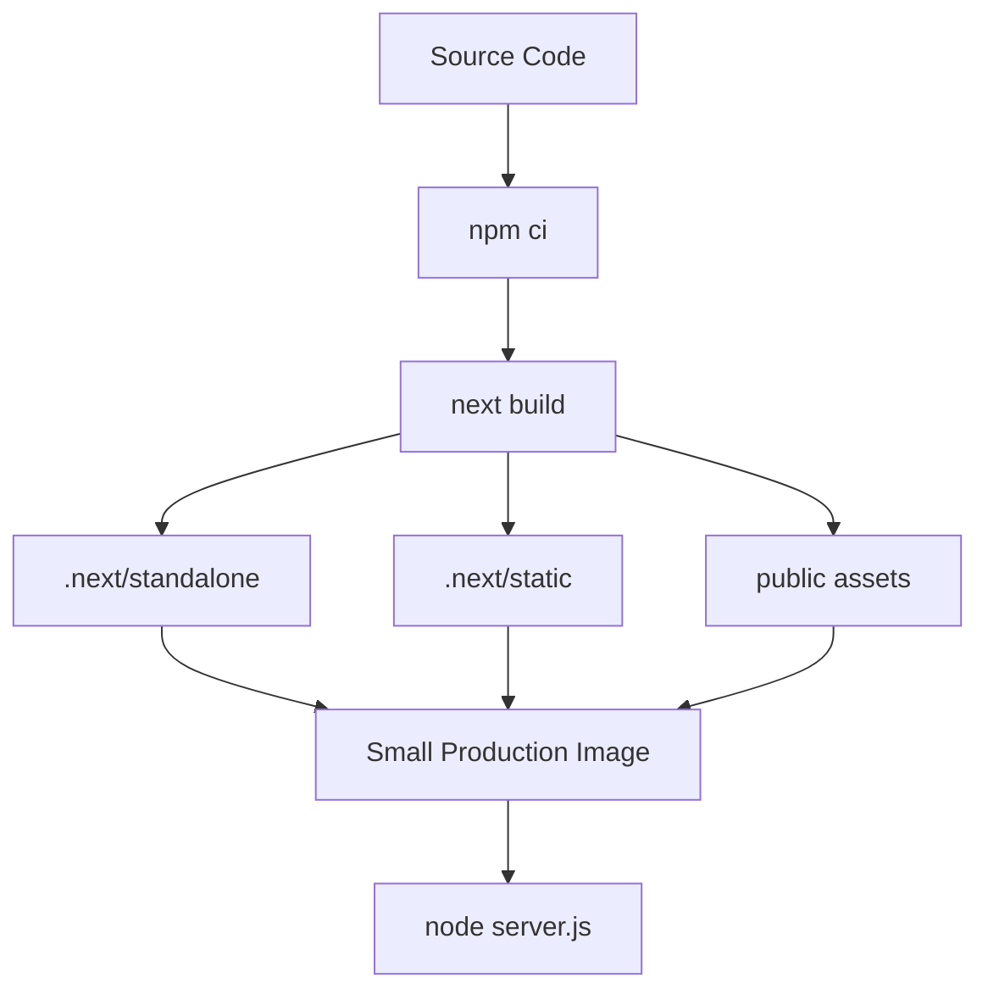

# RealWebStudio VPS Architecture

This project will run as a Dockerized Next.js application on the Hostinger VPS.
Traefik is already running on the VPS and will handle HTTPS, certificates, and routing.

## High-Level Setup



Namecheap only tells browsers where the server is. The actual website runs on the Hostinger VPS.

## DNS

The domain owner should add these records in Namecheap if the domain uses Namecheap DNS:

```text
A  @    187.124.229.161
A  www  187.124.229.161
```

After DNS is active:

- `realwebstudio.com` points to the VPS.
- `www.realwebstudio.com` points to the VPS.
- Traefik receives both domains and redirects `www` to the main domain.

## Request Flow



## Docker Container Layout



Traefik watches Docker labels. The RealWebStudio container has labels telling Traefik:

- route `realwebstudio.com`
- route `www.realwebstudio.com`
- use HTTPS entrypoint `websecure`
- use certificate resolver `letsencrypt`
- send traffic to container port `3000`

## Deployment Flow



First deploy:

```bash
cd /docker
git clone https://github.com/Shivek-cmd/Real-web-Studio-Nextjs.git realwebstudio
cd realwebstudio
docker compose up -d --build
```

Future updates:

```bash
cd /docker/realwebstudio
git pull
docker compose up -d --build
```

## Build Flow Inside Docker



The app uses Next.js `output: "standalone"`, which creates a smaller production server bundle.
The final container does not run `npm run dev`; it runs:

```bash
node server.js
```

## Current Production Files

- `Dockerfile`: builds the Next.js production image.
- `.dockerignore`: keeps unnecessary files out of Docker builds.
- `docker-compose.yml`: starts the app and connects it to Traefik.
- `next.config.ts`: enables Next standalone output.
- `docs/hostinger-vps-deploy.md`: command checklist for deployment.

## Operational Checks

Check running containers:

```bash
docker ps
```

Check app logs:

```bash
docker logs realwebstudio-next --tail=100
```

Restart the app:

```bash
cd /docker/realwebstudio
docker compose restart
```

Stop only this website:

```bash
cd /docker/realwebstudio
docker compose down
```

## Important Notes

- DNS must point to `187.124.229.161` before HTTPS can work correctly.
- Traefik handles SSL certificates automatically through Let's Encrypt.
- The existing n8n and MongoDB containers should not be changed for this website deploy.
- The website container only needs access to the Traefik proxy network.
- `www.realwebstudio.com` redirects to `realwebstudio.com`.
